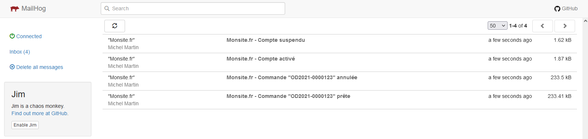
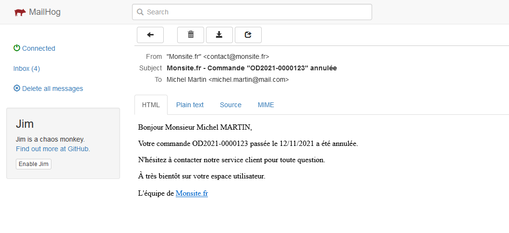

## Mailsender
*POC using PHPMailer, MailHog and Twig*

## Installation

__Requirements__
 - PHP (>= 8.0.0)
 - Composer (>= 2.1.8)
 - MailHog (>= 1.0.1)

__Project__
```
    $ git clone https://github.com/francois-lp/mailsender
    $ cd mailsender
    $ composer install
```

## Getting started
```
    1. Start MailHog 
    2. Open file index.php in a browser (for sending 4 mails)
    3. Open http://localhost:8025/ for consulting with MailHog the mails sended
```

## Links
* [MailHog](https://github.com/mailhog/MailHog)
* [PHPMailer](https://github.com/PHPMailer/PHPMailer)
* [Twig](https://twig.symfony.com/)

## Screenshots


